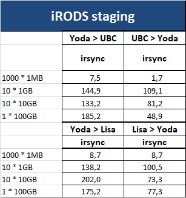
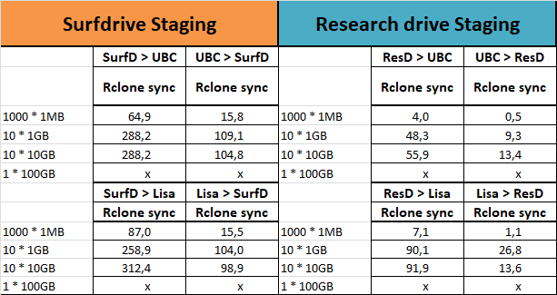
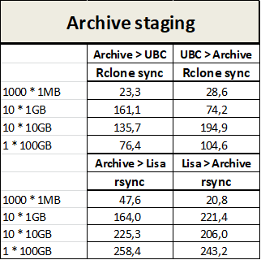

# Evaluation of storage and transfer tools

In our test procedure we have evaluated data transfer to and from three types of storage tools (see below) that can be used as 'central storage facility' in a HPC workflow (see previous [section](./workflow.md)). All types have their own advantages and therefore cover a wide range of possible use cases, from researchers that just need a little more calculation power compared to their own working station, to researchers that work on very computationally expensive or data intensive tasks, to researchgroups that are generating terabytes of data on a frequent basis. Below we provide a short description of the storage tools and evaluation of their performance in terms of data transfer speed and their ease of use.

We evaluated the transfer speed of a few different scenarios ranging from many small files to a few big files:  
* 1000 files of 1 MB
* 10 files of 1 GB
* 10 files of 10 GB
* 1 file of 100 GB

All files are filled with randomly generated data. 

We evaluated transfer speeds between (to and from) several storage platforms (elaborated below) and 2 hpc platforms: 
1. the [Lisa system](https://userinfo.surfsara.nl/systems/lisa/description) that is based at Surfsara.
2. the [UBC cluster](https://wiki.bioinformatics.umcutrecht.nl/HPC) that is based at the UMC.

The tests are not highly standardized, and the results should therefore be interpreted as indicative but not highly accurate. 

## Yoda
For an introduction to Yoda the reader is referred to [this page](https://yoda.sites.uu.nl/home/introduction-to-yoda-2/). In short: Yoda is based on iRODS which is software to manage data and metadata. Yoda has multiple components (or areas) available to the user. One is a research area where data can be stored that still needs to be analyzed. Furthermore, there is a Vault, where data can be securely stored for a longer period. 
It is possible to store very large amounts of data on Yoda, but also small datasets can be transferred to and from local working stations and HPC environments for analyses, which makes Yoda a very versatile tool that is suitable for a full range of users from researchers that just started working with large datasets and high performance computing to research groups that work with very large datasets. 

**Data Transfer**  
The recommended tool for data transfer between Yoda and HPC systems is icommands. [icommands](https://irods.org/download/) is open source software and has to be installed on the HPC system by the system administrator (and is currently available on both the UBC- and Lisa cluster). 

With icommands, individual files are transferred over multiple threads, which results in high transfer speeds, even when transferring one large file.

More background on icommands and instructions for usage of icommands can be found [here](./Yoda.md).

In the table below you can see the transfer speeds for the different test scenarios in MB/s.  

> please note that these values are realized at a particular moment and not based on a highly standardized test procedure. The values can be regarded indicative, but deviations will occur depending on many factors.

**Local availability of Yoda data**  
The typical way to get access to your data on your local working station is to mount your Yoda usergroups as a remote network drive on the local working station ([instructions](https://yoda.sites.uu.nl/home/how-to-quick-guide/create-a-network-share/create-a-network-share-on-windows/)). This mount is visible as a network drive in your windows explorer. However, when you want to do computationally expensive operations on your data on your local working station, you may run into errors; the data is still stored remotely and therefore not accessible fast enough for certain calculations. A workaround for such issues is to transfer the files to your local working station manually by 'drag-and-drop' files from your mounted network drive or using a client like Cyberduck or icommands. Visit [this page](./Yoda_local.md) for instructions on how to use clients like cyberduck and icommands for data transfer to your local working station. 

## Surfdrive and other cloud storage platforms

Many people use cloud storage platforms like Surfdrive, Dropbox, Onedrive or Google Drive. On these platforms, a user typically gets a certain amount of storage space for free. For additional storage space the user needs a paid premium account. At the time of writing, employees of the UU have access to a [Surfdrive](https://www.surfdrive.nl/) account with 250 GB of storage space. 

In general, the abovementioned cloud storage platforms are very user friendly. The user has to install an application on the local working station that takes care of synchronization of files and folders between storage platform and any device where the user has installed the application. This synchronization may take a significant amount of time, depending on file size and internet connection. This functionality is therefore very useful for users with many small files, and perhaps less useful for users working with large data volumes. 

Some of the storage platform perform really well in a HPC workflow, with reasonably simple connection possibilities and high transfer speeds.

**Data Transfer**  
The recommended tool for data transfer between cloud storage platforms and HPC systems is [Rclone](https://rclone.org/). Rclone is open source, and it is very easy to install by the user on the UBC cluster or other HPC platforms (installation instruction provided [here](./surfdrive.md)). Rclone is already installed on the Lisa cluster.

With Rclone, multiple files can be transferred in parallel (e.g. 16 files at the same time), which results in high transfer speeds when transferring multiple files.

Some issues occur when transferring large files to and from HPC platforms using Rclone. This is due to a time-outs of the connection when the transfer time exceeds a certain amount of time. Therefore we couldn't test the 1 * 100 GB scenario. It is expected that these issues will be solved in the near future.

More background on Rclone and instructions for usage of Rclone for several cloud storage platforms can be found [here](./surfdrive.md).

Other options for transfer include: manual drag-and-drop transfer using [Winscp](https://winscp.net/) or [Cyberduck](https://cyberduck.io/).

In the table below you can see the transfer speeds between surfdrive and Lisa/UBC for the different test scenarios in MB/s:

> please note that these values are realized at a particular moment and not based on a highly standardized test procedure. The values can be regarded indicative, but deviations will occur depending on many factors.

## SURFsara Data Archive

The [SURFsara Data Archive](https://userinfo.surfsara.nl/systems/shared/archive-file-system) is a storage platform, where users typically store large amounts (up to petabytes) of data for the long term. The data is stored on a tape robot which is safe and relatively cheap. There is also a disk-based file system (staging area) for exchanging data with remote sources (working stations, hpc platforms, or other storage platforms), as well as sending to tape for long term storage and retrieving data from tape for analyses. 

Retrieving data from tape to the staging area (before transfer to- and use on HPC clusters) is not difficult but can take a certain (unpredictable) amount of time. This has to be done before accessing the data from e.g. HPC platforms for analyses.

**Data Transfer**  
On Lisa (and Cartesius), the staging area of the archive is assible directly via the Unix path. Files can therefore be browsed and handled using standard unix commands (cp, rsync, etc), which is very convenient (instruction [here](./Archive.md)). 

Rclone can be used to exchange data between other HPC platforms and the staging area of the Data archive (instructions  [here](./ArchiveUBC.md)).  

The reported transfer speeds below are between the staging area of the Data Archive and the HPC platforms in MB/s. Exchange between staging area and tape robot is unpredictable and not tested.

> please note that these values are realized at a particular moment and not based on a highly standardized test procedure. The values can be regarded indicative, but deviations will occur depending on many factors.

## Links

[Transfer Instructions Yoda](./Yoda.md)  
[Transfer Instructions Cloud Storage](./surfdrive.md)  
[Transfer Instructions Data Archive](./Archive.md)  
[Glossary](./Glossary.md)  

Previous: [Typical Workflow](./workflow.md)

