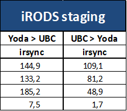

# Evaluation of storage and transfer tools

In our test procedure we have evaluated three types of storage tools (see below) that can be used as 'central storage facility' in a HPC workflow (see previous [section](./workflow.md)). All types have their own advantages and therefore cover a wide range of possible use cases, from researchers that just need a little more calculation power compared to their own working station, to researchers that work on very computationally expensive or data intensive tasks, to researchgroups that are generating terabytes of data on a frequent basis. Below we provide a short description of the storage tools and evaluation of their performance in terms of data transfer speed and their ease of use.

To test the transfer speed we evaluated the transfer speed of a few different scenarios ranging from many small files to a few big files:  
* 1000 files of 1 MB
* 10 files of 1 GB
* 10 files of 10 GB
* 1 file of 100 GB

All files are filled with randomly generated data.

We evaluated transfer speeds between (to and from) several storage platforms (elaborated below) and 2 hpc platforms: 
1. the [Lisa system](https://userinfo.surfsara.nl/systems/lisa/description) that is based at Surfsara.
2. the [UBC cluster](https://wiki.bioinformatics.umcutrecht.nl/HPC) that is based at the UMC.

###Yoda
For an introduction to Yoda the reader is referred to [this page](https://yoda.sites.uu.nl/home/introduction-to-yoda-2/), where the most important information can be found. In short: Yoda is based on iRODS which is software to manage data and metadata. Yoda has multiple components. One is a research area where data can be stored that still needs to be analyzed. Furthermore, there is a Vault, where data can be securely stored for a longer period. 
It is possible to store very large amounts of data on Yoda, but also small datasets can be transferred to and from local working stations and HPC environments for analyses, which makes Yoda a very versatile tool that is suitable for a full range of users from researchers that just started working with large datasets and high performance computing to research groups that work with very large datasets.

*Data Transfer* 
The recommended tool for data transfer is icommands. [icommands](https://irods.org/download/) is open source software and has to be installed on the HPC system by the system administrator (and is currently available on both the UBC- and Lisa cluster). 

More background on icommands and instructions for usage of icommands can be found [here](./Yoda.md).

Other options for transfer include: webdav connection using [Rclone](https://rclone.org/) or manual transfer using [Winscp](https://winscp.net/) or [Cyberduck](https://cyberduck.io/).

Transfer speeds:

Surfdrive

Archive

