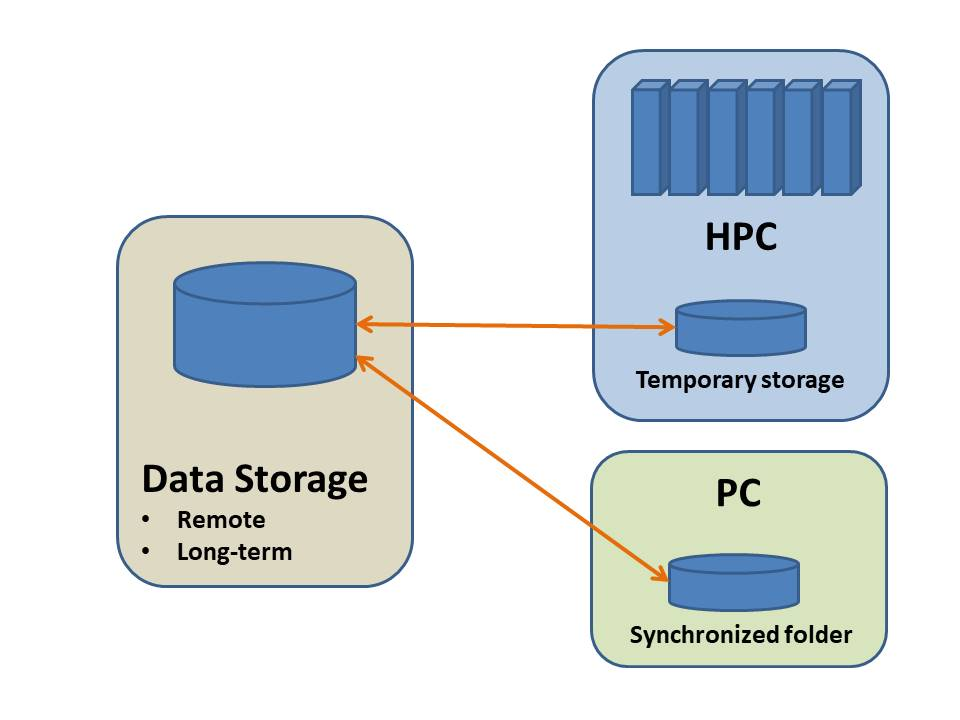

# Typical HPC workflow

In order to keep a clear overview of the most recent versions of your data and scripts, it is recommended to use one central storage facility in your workflow, such as YODA, Surfdrive, or a data archive. You can access the data from any working station (e.g. your own laptop) And when you do analyses on a HPC platform, you can transfer data from the storage facility to the HPC system and when your job is done you transfer the output back to storage. 

{:height="80px" width="80px"}

## Storage
YODA (developed at the UU) is a tool that can be used as this central storage facility (https://yoda.sites.uu.nl/home/introduction-to-yoda-2/). YODA is built on state-of-the-art data storage and transfer technology and is suitable for a full range from researchers that just started working with large datasets and high performance computing to research groups that work with very large datasets. Yoda is not only a handy tool for long-term and secure storage of data; it is also possible to synchronize data to various platforms at very high transfer speeds. Alternatives are cloud storage platforms such as Surfdrive (SURFsara) and Google Drive (commercial), or Data-Archive (SURFsara).

## Data transfer and synchronization; ‘drag and drop’ versus command line tools
For users that are only used to working with Windows or Apple computers, tools are available to connect to remote data storage as well as storage systems of HPC platforms and manually transfer files using ‘drag and drop’ principles. Open source tools in this category are Winscp and Cyberduck, or the more versatile MobaXterm, which can also be used for login in to HPC platforms. These tools are solid and intuitive for beginning users, but also somewhat slow which becomes relevant when you frequently need to transfer many gigabytes of data.
For users that are experienced with using command line and/or users that need to transfer large amounts of data, command line tools exist that are more efficient. The above-mentioned storage system YODA is typically accessed via ‘icommands’. Another very versatile tool that can be used in combination with many storage platforms is ‘Rclone’. These tools can be operated directly on the HPC platform and transfer commands can be incorporated in job scripts. 

Next: [Evaluation of storage and transfer tools](./Evaluation.md)

Links:
[Main page](../README.md)
[Yoda staging](./Yoda.md)
[Surfdrive staging](./surfdrive.md)
[Archive staging](./Archive.md)

